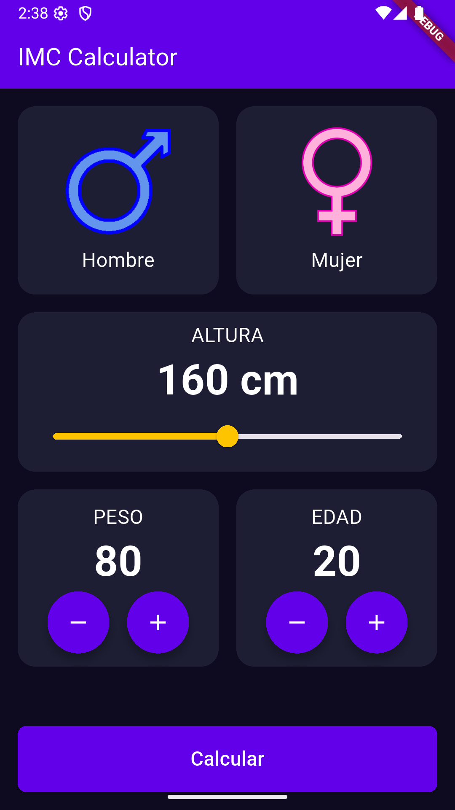

# IMC Calculator

**IMC Calculator** es una aplicación moderna y sencilla desarrollada en **Flutter** que te permite calcular tu Índice de Masa Corporal (IMC) de manera rápida e intuitiva.

Con un diseño limpio y fácil de usar, esta herramienta te ayuda a monitorear tu estado de salud basándose en tu peso y altura.

## 🚀 Características Principales

*   **Interfaz Intuitiva:** Diseño amigable que facilita la entrada de datos.
*   **Selección de Género:** Opción para personalizar el cálculo (aunque el cálculo base es general, prepara la UI para futuras expansiones).
*   **Ajuste de Altura:** Slider interactivo para seleccionar tu altura con precisión.
*   **Control de Peso y Edad:** Botones de incremento y decremento rápido para ajustar peso y edad.
*   **Resultados Detallados:**
    *   Cálculo exacto del IMC.
    *   **Clasificación por Colores:** Identifica rápidamente tu estado (Bajo peso, Normal, Sobrepeso, Obesidad) gracias a indicadores visuales (Amarillo, Verde, Naranja, Rojo).
    *   **Consejos de Salud:** Recibe una breve recomendación basada en tu resultado.

## 🛠️ Tecnologías Utilizadas

*   **[Flutter](https://flutter.dev/):** Framework principal para el desarrollo de la UI.
*   **Dart:** Lenguaje de programación.

## 📸 Capturas de Pantalla

| Inicio | Resultados |
|:---:|:---:|
|  |  |

## 🔧 Instalación y Ejecución

Sigue estos pasos para correr el proyecto en tu entorno local:

1.  **Clonar el repositorio:**
    ```bash
    git clone https://github.com/Dainel-Samuel/IMC-Calculator.git
    cd IMC-Calculator
    ```

2.  **Instalar dependencias:**
    Asegúrate de tener Flutter instalado y corre:
    ```bash
    flutter pub get
    ```

3.  **Ejecutar la aplicación:**
    Conecta tu dispositivo o inicia un emulador y ejecuta:
    ```bash
    flutter run
    ```
